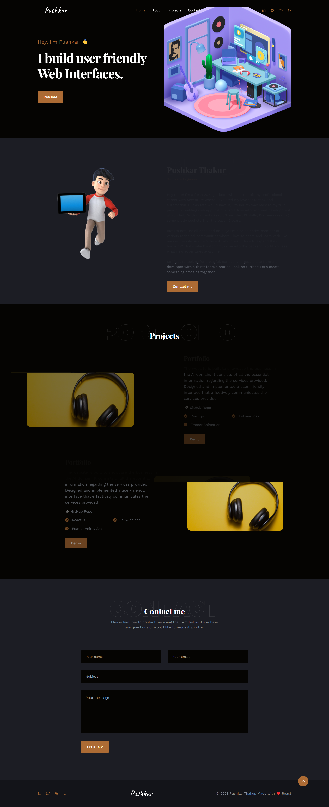

<h1 align="center"><strong>Portfolio</strong></h1>

A personal developer portfolio site that provides a concise introduction about me and demonstrates my programming skills and experience.

## Live Demo

## Tech/framework used

<b>Built With</b>

- [React](https://reactjs.org/) <code></code>

## Screenshots

|

## How to use?

### `npm install`

It will install all node pakages for you

In the project directory, you can run:

### `npm start`

Runs the app in the development mode. 
Open [http://localhost:3000](http://localhost:3000) to view it in the browser.

The page will reload if you make edits. 
